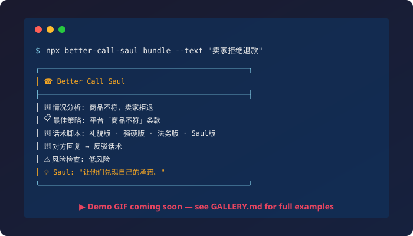

<!-- Badges -->
<p align="center">
  <a href="https://github.com/zzy2289/better-call-saul/actions/workflows/ci.yml"></a>
  <a href="https://nodejs.org"></a>
  <a href="LICENSE"></a>
  
</p>

<h1 align="center">Better Call Saul ☎️</h1>

<p align="center">
  <strong>把杂乱的纠纷变成赢的策略。</strong><br>
  Turn messy disputes into winning strategies — copy-ready scripts, counter-replies, risk checks, and a Saul-style commentary, all inside the AI agent you already use.
</p>

<p align="center">
  <a href="#quickstart">Quick Start</a> •
  <a href="GALLERY.md">Gallery</a> •
  <a href="docs/INSTALL.md">Install Guide</a> •
  <a href="#why-not-just-chatgpt">Why not just ChatGPT?</a> •
  <a href="README.zh-CN.md">中文</a>
</p>

<!-- TODO: Replace with actual demo GIF after recording (P3-2) -->
<p align="center">
  
</p>

---

## The Problem

You got ripped off. The seller ghosted you. Your landlord stole your deposit. A client won't pay. The hotel "overbooked."

You know you're right — but you don't know **what to say**, **who to escalate to**, or **how to make them actually do something**.

## The Fix

Better Call Saul is a plug-in for your AI agent (Claude Code / OpenClaw). Give it your messy situation, and it returns a **structured 10-section battle plan**:

| # | Section | What you get |
|---|---------|-------------|
| 1 | Situation Read | Clear summary of what happened |
| 2 | What You Want | Your actual goal, stated precisely |
| 3 | Leverage Map | Every piece of evidence and pressure point |
| 4 | Best Strategy | The angle most likely to win |
| 5 | Scripts × 4 | Polite · Firm · Legalistic · Saul-style — copy-paste ready |
| 6 | Their Reply | What the other side will probably say |
| 7 | Counter-Reply | Your comeback for each likely response |
| 8 | Risk Check | What could go wrong and how to avoid it |
| 9 | Saul Commentary | Why this angle works (the strategic "why") |
| 10 | Next Moves | Exact action checklist with deadlines |

> **Example:** "The laptop I bought was listed as 'new' but arrived scratched with 300+ battery cycles."
>
> **Saul says:** *"You're not asking for a favor — you're holding them to their own word. The cycle count is the kill shot; lead with it."*
>
> → [See 6 full examples in the Gallery](GALLERY.md)

---

<h2 id="quickstart">⚡ Quick Start — 3 Steps</h2>

```bash
# 1. Install
npm install && npm run build

# 2. Plug into your agent host
npx better-call-saul install --host auto   # auto-detects Claude Code / OpenClaw

# 3. Ask your agent
# Just describe your situation in your agent — Saul takes over.
```

Or, without a host — generate a paste-ready prompt bundle:

```bash
npx better-call-saul bundle --text "My landlord is keeping my $1800 deposit for 'cleaning' but I have move-in photos proving it was already dirty"
```

> Full install guide for Claude Code & OpenClaw → [docs/INSTALL.md](docs/INSTALL.md)

---

<h2 id="why-not-just-chatgpt">🤔 Why Not Just Ask ChatGPT?</h2>

| | Just ChatGPT / Claude | Better Call Saul |
|---|---|---|
| **Structure** | Free-form text, different every time | Consistent 10-section format with scripts, risks, counters |
| **Scripts** | Generic "be polite" advice | 4 tones (polite / firm / legalistic / Saul-style), copy-paste ready |
| **Counter-moves** | You have to ask "what if they say X?" manually | Pre-built: their likely replies + your comebacks, included by default |
| **Risk awareness** | Might suggest something legally questionable | Built-in safety rails — refuses forgery, threats, impersonation |
| **Domain knowledge** | General training data | 16 specialized knowledge packs (e-commerce, landlord, chargeback, 12315, insurance…) |
| **Consistency** | Prompt engineering every time | One install, consistent persona + quality every time |
| **Language** | You specify each time | Auto zh/en/bilingual based on your input |
| **Reusable** | Conversation disappears | Structured output you can save, share, and act on |

**TL;DR:** ChatGPT gives you _a_ answer. Saul gives you _a system_ — scripts for every tone, counters for every excuse, and a checklist to actually follow through.

---

## What It Covers

Better Call Saul ships 16 domain knowledge packs and handles:

- 🛒 **E-commerce** — refunds, "not as described," shipping damage, marketplace disputes
- 🏠 **Landlord & Tenant** — deposit disputes, maintenance failures, illegal deductions
- 💼 **Freelance & Business** — late payment, scope creep, contract red flags
- ✈️ **Travel** — hotel overbooking, flight cancellation, OTA runaround
- 🏦 **Banking & Insurance** — unfair fees, claim denials, chargeback guidance
- 📱 **Subscriptions** — dark-pattern cancellation, unauthorized renewals
- 🇨🇳 **China-specific** — 12315, 消费者权益保护法, 电商平台投诉
- 📝 **Reputation** — responding to bad reviews, managing public disputes
- ⚖️ **Employment** — wage disputes, wrongful termination basics
- 🔧 **Warranty & Debt** — warranty claims, debt collection harassment

---

## Safety — Aggressive Strategy, Conservative Ethics

Saul will help you win, but won't cross the line.

✅ **Will do:** persuasive scripts, evidence-based escalation, firm but lawful pressure, multi-tone negotiation

🚫 **Won't do:** forge evidence, impersonate lawyers, fabricate complaints, threaten or blackmail, file fake chargebacks

> Every prompt bundle is screened for risk level. High-risk requests get safety guardrails injected automatically. [Full safety policy →](docs/SAFETY_POLICY.md)

---

## Architecture

```
better-call-saul/
├── SOUL.md              # Persona, mission, output contract, safety red lines
├── knowledge/           # 16 domain knowledge packs
├── skills/              # 4 OpenClaw-compatible skills
│   ├── complaint-handler/
│   ├── negotiation-simulator/
│   ├── angle-finder/
│   └── risk-assessor/
├── examples/            # 22 real-world scenarios
├── eval/                # Quality eval suite (10 cases, 9-dimension scoring)
├── src/                 # TypeScript CLI core
├── test/                # 150 tests (vitest)
└── docs/                # Install, architecture, safety, roadmap
```

### CLI Commands

```bash
saul doctor                    # Environment + repo health check
saul validate                  # Validate files, skills, schemas, references
saul detect-hosts              # Find Claude Code / OpenClaw on this machine
saul install --host <host>     # Install into your agent host
saul uninstall --host <host>   # Clean uninstall (only removes what it installed)
saul classify --text "..."     # Route a dispute to the right skill + knowledge
saul bundle --text "..."       # Generate a paste-ready prompt bundle
saul check-refs                # Detect drift between reference copies and sources
```

---

## Contributing

PRs welcome! See [CONTRIBUTING.md](CONTRIBUTING.md). Please read [AGENTS.md](AGENTS.md) for repo conventions.

## Disclaimer

Fan-inspired open-source project. **Not affiliated with** AMC, Sony Pictures Television, Netflix, Vince Gilligan, Peter Gould, or any entity associated with the TV series *Better Call Saul* or *Breaking Bad*. This project uses an original "Saul-inspired fixer" persona and does not reproduce copyrighted dialogue or scenes. See [DISCLAIMER.md](DISCLAIMER.md).

## License

[MIT](LICENSE) for original code and docs. Trademark/trade-dress exclusions apply — see [DISCLAIMER.md](DISCLAIMER.md).
