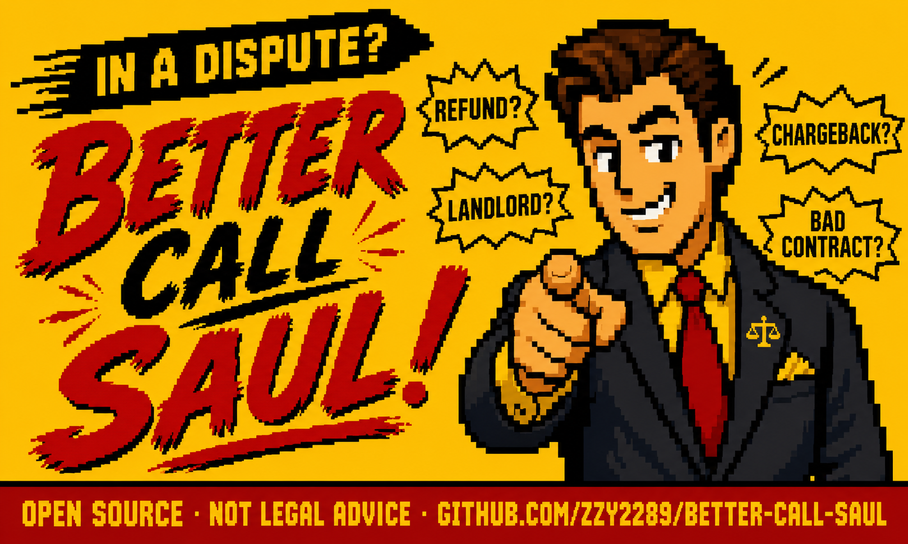

<!-- 徽章 -->
<p align="center">
  <a href="https://github.com/zzy2289/better-call-saul/actions/workflows/ci.yml"></a>
  <a href="https://nodejs.org"></a>
  <a href="LICENSE"></a>
</p>

<h1 align="center">Better Call Saul ☎️</h1>

<p align="center">
  <strong>把杂乱的纠纷变成赢的策略。</strong><br>
  退款被拒？押金被扣？客户赖账？一键生成话术、反驳脚本、升级路径和风险评估。
</p>

<p align="center">
  <a href="#快速开始">快速开始</a> •
  <a href="GALLERY.md">案例展示</a> •
  <a href="docs/INSTALL.md">安装指南</a> •
  <a href="#为什么不直接问-chatgpt">为什么不直接问 ChatGPT？</a> •
  <a href="README.md">English</a>
</p>

<p align="center">
  
</p>

---

## 痛点

退款被拒。房东扣押金。甲方不付钱。酒店超售把你换到差房间。

你知道你有理——但你不知道**该怎么说**、**该找谁**、**怎么让对方真正行动**。

## 解决方案

Better Call Saul 是你的 AI 智能体（Claude Code / Codex / OpenClaw）的一个插件。把你的情况丢进去，它给你一份**结构化的 10 段作战计划**：

| # | 模块 | 你会得到什么 |
|---|------|-------------|
| 1 | 情况分析 | 发生了什么的清晰梳理 |
| 2 | 你的诉求 | 你到底要什么，精确表述 |
| 3 | 筹码地图 | 所有证据和施压点 |
| 4 | 最佳策略 | 最可能赢的切入角度 |
| 5 | 话术脚本 ×4 | 礼貌版 · 强硬版 · 法务版 · Saul 风格版 — 直接复制发送 |
| 6 | 对方回复 | 对方可能怎么说 |
| 7 | 反驳话术 | 针对对方每种回复的反击 |
| 8 | 风险检查 | 可能出什么问题、如何规避 |
| 9 | Saul 点评 | 为什么这个角度有效（策略层面的「为什么」） |
| 10 | 下一步行动 | 精确的执行清单和时间节点 |

> **举例：** "我买的笔记本标注'全新'，到手有划痕，电池循环 300 多次。"
>
> **Saul 说：** *"你不是在求人——你是在让他们兑现自己说的话。电池循环数就是致命一击，先亮这个。"*
>
> → [查看 6 个完整案例](GALLERY.md)

---

<h2 id="快速开始">⚡ 快速开始 — 3 步搞定</h2>

```bash
# 1. 安装
npm install && npm run build

# 2. 接入你的智能体
npx better-call-saul install --host auto   # 自动检测 Claude Code / Codex / OpenClaw

# 3. 开聊
# 在你的智能体里描述你的情况 — Saul 接管。
```

或者，不用宿主——直接生成可粘贴的 prompt 包：

```bash
npx better-call-saul bundle --text "房东扣了我1万8押金说要清洁费，但我有入住时的照片证明本来就脏" --lang zh
```

> 完整安装指南（Claude Code、Codex & OpenClaw）→ [docs/INSTALL.md](docs/INSTALL.md)

---

<h2 id="为什么不直接问-chatgpt">🤔 为什么不直接问 ChatGPT？</h2>

| | 直接问 ChatGPT / Claude | Better Call Saul |
|---|---|---|
| **结构** | 自由文本，每次不一样 | 固定 10 段格式：话术、风险、反驳一步到位 |
| **话术** | 笼统的「礼貌沟通」建议 | 4 种语气（礼貌/强硬/法务/Saul 风格），直接复制粘贴 |
| **反驳** | 要自己追问「如果对方说 X 怎么办？」 | 预置：对方可能的回复 + 你的反击，默认包含 |
| **风险** | 可能建议法律上有问题的做法 | 内置安全护栏——拒绝伪造证据、威胁、冒充 |
| **领域知识** | 通用训练数据 | 16 个专业知识包（电商、房东、chargeback、12315、保险……） |
| **一致性** | 每次都要自己写 prompt | 装一次，每次输出品质一致 |
| **语言** | 每次要指定 | 根据输入自动切换中/英/双语 |
| **可复用** | 对话结束就没了 | 结构化输出，可保存、分享、执行 |

**一句话总结：** ChatGPT 给你 _一个_ 回答。Saul 给你 _一套系统_ ——每种语气的话术、每种借口的反击、以及一份可以照着执行的行动清单。

---

## 覆盖场景

Better Call Saul 内置 16 个领域知识包：

- 🛒 **电商** — 退款、商品不符、物流损坏、平台投诉
- 🏠 **房东租客** — 押金纠纷、维修不作为、违规扣款
- 💼 **自由职业 & 商业** — 客户拖欠、需求蔓延、合同红旗
- ✈️ **旅行** — 酒店超售、航班取消、OTA 踢皮球
- 🏦 **银行 & 保险** — 不合理收费、拒赔、chargeback 指南
- 📱 **订阅服务** — 暗黑模式取消、未授权续费
- 🇨🇳 **中国专属** — 12315、消费者权益保护法、电商平台投诉流程
- 📝 **口碑管理** — 回复差评、处理公开争议
- ⚖️ **劳动纠纷** — 工资争议、违法解雇基础
- 🔧 **质保 & 催收** — 保修索赔、骚扰式催收应对

---

## 安全原则 — 策略激进，底线保守

Saul 帮你赢，但不会越线。

✅ **会做的：** 有说服力的话术、基于证据的升级、合法但强硬的施压、多语气谈判脚本

🚫 **不会做的：** 伪造证据、冒充律师、编造投诉、威胁勒索、虚假 chargeback

> 每个 prompt 包都会自动评估风险等级。高风险请求会被注入安全护栏。[完整安全策略 →](docs/SAFETY_POLICY.md)

---

## 项目结构

```
better-call-saul/
├── SOUL.md              # 人设、使命、输出契约、安全红线
├── knowledge/           # 16 个领域知识包
├── skills/              # 4 个 OpenClaw 兼容技能
│   ├── complaint-handler/      # 投诉处理器
│   ├── negotiation-simulator/  # 谈判模拟器
│   ├── angle-finder/           # 角度发现器
│   └── risk-assessor/          # 风险评估器
├── examples/            # 22 个真实场景
├── eval/                # 质量评测套件（10 案例，9 维度评分）
├── src/                 # TypeScript CLI 核心
├── test/                # 150 个测试 (vitest)
└── docs/                # 安装、架构、安全、路线图
```

### CLI 命令

```bash
saul doctor                    # 环境 + 仓库健康检查
saul validate                  # 校验文件、技能、Schema、引用
saul detect-hosts              # 检测本机的 Claude Code / Codex / OpenClaw
saul install --host <host>     # 安装到你的智能体宿主
saul uninstall --host <host>   # 干净卸载（只删自己装的文件）
saul classify --text "..."     # 将纠纷路由到合适的技能 + 知识包
saul bundle --text "..." --lang zh  # 生成可粘贴的中文 prompt 包
saul check-refs                # 检测引用副本与源文件的漂移
```

---

## 参与贡献

欢迎 PR！请先阅读 [CONTRIBUTING.md](CONTRIBUTING.md) 和 [AGENTS.md](AGENTS.md) 了解仓库约定。

## 免责声明

粉丝启发的开源项目。**与** AMC、Sony Pictures Television、Netflix、Vince Gilligan、Peter Gould 或与电视剧 *Better Call Saul*、*Breaking Bad* 相关的任何实体**无关联**。本项目使用原创的「Saul 风格 fixer」人设，不复制受版权保护的台词或场景。详见 [DISCLAIMER.md](DISCLAIMER.md)。

## 许可证

[MIT](LICENSE) 适用于原创代码和文档。商标/商业外观排除适用——详见 [DISCLAIMER.md](DISCLAIMER.md)。
